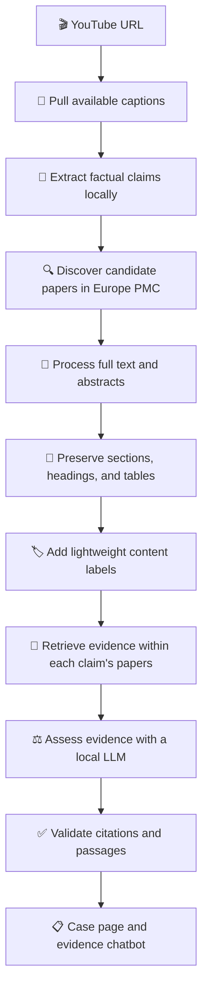

<div align="center">

# 🔎 Check Your Fact

### Evidence-grounded fact checking for health and science claims in video.

<p>
  <strong>Local-first.</strong>
  <strong>Open-source.</strong>
  <strong>Built on real scientific literature.</strong>
</p>

<p>
  Turn a YouTube video into a claim-by-claim evidence report — with retrieved papers,
  grounded verdicts, and citations that are checked before they are shown.
</p>

<p>
  
  
  
  
</p>

<p>
  <a href="#-the-problem">The Problem</a>
  ·
  <a href="#-how-it-works">How It Works</a>
  ·
  <a href="#-evidence-verdicts">Verdicts</a>
  ·
  <a href="#-design-principles">Principles</a>
  ·
  <a href="#-roadmap">Roadmap</a>
  ·
  <a href="#-stack">Stack</a>
</p>

</div>

<br />

> [!IMPORTANT]
> **Check Your Fact is an evidence-navigation tool, not medical advice.**
> It helps surface, organize, and explain published research for claims made in media. It does not replace a qualified healthcare professional.

---

## ✨ What Is Check Your Fact?

**Check Your Fact** is a fully local tool for investigating health and science claims made in online videos.

Give it a YouTube URL. It pulls the available captions, extracts the factual claims actually made in the video, searches scientific literature for relevant papers, and produces an evidence-grounded verdict for every claim:

| Verdict | What it means |
|:--|:--|
| 🟢 **Supported** | The retrieved evidence broadly supports the claim. |
| 🔴 **Contradicted** | The retrieved evidence conflicts with the claim. |
| 🟡 **Uncertain** | Evidence is mixed, limited, indirect, or insufficient for a firm conclusion. |

Every conclusion is tied to retrieved evidence — not the model’s internal knowledge — and every displayed citation is validated against the papers and passages actually indexed for that claim.

<br />

<div align="center">

```text
YouTube video → Claims → Scientific papers → Retrieved evidence → Grounded verdict
```

</div>

---

## 🎯 The Problem

Health and science claims travel faster than the research behind them.

A video can make dozens of confident statements in minutes, while verifying those claims usually requires searching databases, reading papers, interpreting limitations, and working out whether the cited evidence actually supports the conclusion.

**Check Your Fact is built to make that process more accessible without pretending that science is always simple.**

It is designed to answer questions such as:

- Is this claim actually supported by published research?
- Which studies support it, and which studies disagree?
- Is the evidence direct, limited, mixed, or only based on abstracts?
- What did a paper actually find?
- Why did a claim receive an **uncertain** verdict?
- What are the limitations of the evidence behind this conclusion?

---

## 🧠 The Core Idea

> **Do not ask an LLM to “know” science.**
>
> Ask it to work from retrieved scientific evidence — then verify that its citations are real.

Check Your Fact is built around a simple rule:

```text
No retrieved evidence → no evidence-based conclusion.
```

The local LLM is responsible for reading, extracting, comparing, and explaining. It is not allowed to fill gaps with its own internal knowledge when assessing claims.

---

## 🔄 How It Works



### ① Submit a video

Submit a **YouTube URL**.

For the current input path, the tool pulls existing captions directly from YouTube. No audio processing is needed when captions are available.

### ② Extract factual claims

A local LLM reads the transcript and extracts factual, researchable claims.

It is constrained to use only what the speaker actually said:

- No invented claims
- No invented context
- No turning vague opinions into factual statements
- No filling in information that was not in the video

### ③ Discover relevant literature

For every extracted claim, the system searches **Europe PMC** for potentially relevant scientific papers.

Up to 20 deduplicated candidate papers can be collected per claim.

### ④ Process scientific papers properly

The most promising open-access papers are processed as full text rather than flattened into plain text.

Scientific papers have meaningful structure. Check Your Fact preserves:

- Section hierarchy
- Headings and subheadings
- Tables
- Captions
- Structural context around findings
- Paper-level metadata

This matters because important scientific evidence often lives in tables, just as important financial evidence often lives in financial statements.

### ⑤ Enrich chunks without inventing metadata

Each processed chunk gets a short, local-LLM-written content label describing what it is about.

That label sits alongside metadata retrieved programmatically from Europe PMC:

| Programmatic metadata | LLM-generated enrichment |
|:--|:--|
| Title | Short chunk description |
| Authors | Content-focused label |
| Journal | — |
| Publication year | — |
| Open-access status | — |
| Full text or abstract-only status | — |

The LLM does not recreate facts that the source already provides structurally. Its role is limited to describing content in a retrieval-friendly way.

### ⑥ Retrieve evidence per claim

Retrieval is strictly scoped to the papers discovered for the specific claim being investigated.

```text
Claim A
  └── Candidate papers for Claim A
        └── Retrieve passages only from Claim A papers

Claim B
  └── Candidate papers for Claim B
        └── Retrieve passages only from Claim B papers
```

Evidence for one claim cannot silently appear in another claim’s assessment.

### ⑦ Produce an evidence-grounded verdict

A local LLM reviews the retrieved passages and generates:

- A verdict: **supported**, **contradicted**, or **uncertain**
- Key findings from each relevant paper
- Important limitations
- Evidence-quality context
- Source links and citations tied to the retrieved content

### ⑧ Validate citations before display

Before anything appears in the final result, the application checks that:

- The cited paper was discovered for that claim.
- The paper was actually indexed.
- The quoted or referenced passage exists in the retrieved content.
- The citation is connected to the evidence used in the verdict.

```text
Retrieved paper?        ✓
Indexed for this claim? ✓
Retrieved passage exists?✓
Citation matches source? ✓
──────────────────────────
Show it to the user.    ✓
```

---

## 🧪 Evidence Verdicts

Not all evidence has equal strength, and not every question has a clean answer.

Check Your Fact makes that uncertainty visible rather than hiding it behind confident language.

| Verdict | Interpretation | Example situation |
|:--|:--|:--|
| 🟢 **Supported** | The retrieved literature broadly aligns with the claim. | Multiple relevant studies report findings consistent with the claim. |
| 🔴 **Contradicted** | The retrieved literature conflicts with the claim. | Stronger or more direct evidence points in the opposite direction. |
| 🟡 **Uncertain** | The evidence does not justify a confident conclusion. | Results are mixed, evidence is indirect, sample sizes are limited, or only abstracts are available. |

> [!NOTE]
> **Uncertain does not mean false.**
>
> It means the retrieved evidence does not support a strong, reliable conclusion yet.

---

## 💬 Case-Scoped Chatbot

Every completed analysis becomes a **case**: a claim-by-claim report with its own evidence index.

The chatbot is scoped to that case alone. It can answer follow-up questions using only the papers and passages already discovered and indexed for that analysis.

### Ask questions like:

- *Why did this claim receive an uncertain verdict?*
- *Which studies support this claim?*
- *Which studies disagree with it?*
- *What did this paper actually find?*
- *What limitations did the authors report?*
- *How does the evidence compare across multiple claims in this video?*

### What it cannot do

The chatbot cannot casually introduce scientific information that was never retrieved for the case.

```text
Outside knowledge not indexed for this case
                    ↓
              Not eligible
                    ↓
          Cannot be used in answers
```

This keeps follow-up answers tied to the same evidence base as the original verdicts.

---

## 🏗️ Design Principles

### 🔀 Separate discovery from retrieval

**Discovery** decides which papers are worth considering for a claim.

**Retrieval** finds the most relevant passages only within those discovered papers.

This separation reduces cross-claim contamination and makes every evidence trail easier to inspect.

### 🧾 Preserve document structure

Scientific articles are not just a collection of paragraphs.

Sections, study methods, results tables, captions, and limitations all carry meaning. Processing papers in a structure-aware way helps preserve that context during retrieval.

### 🪶 Use the smallest capable model

Different jobs need different levels of reasoning.

| Task | Model approach |
|:--|:--|
| Claim extraction | Local 7–8B model |
| Evidence assessment | Local 7–8B model |
| Metadata enrichment | Local sub-1B model |

A lightweight model can write a one-line chunk label without consuming the resources needed for evidence evaluation.

### 🔍 Never invent what can be retrieved

If Europe PMC already provides a piece of information, the application attaches it programmatically.

The LLM should not generate details that the source can provide directly, including titles, years, authors, journals, and access status.

### ⚖️ Be transparent about evidence quality

Sources are visibly labeled as:

- 📄 **Full text**
- 📝 **Abstract only**
- 📚 **Background context**

General-audience health summaries may be useful context, but they are kept separate from scientific evidence and are never counted as a study.

---

## 🗺️ Roadmap

### ✅ Phase 1 — Core Pipeline and Retrieval Validation

> **Goal:** Get one input type working end to end, then test whether semantic-only retrieval is actually good enough.

- [x] YouTube URL → captions → claims
- [x] Local claim extraction
- [x] Local evidence assessment
- [x] Europe PMC paper discovery
- [x] Up to 20 deduplicated candidate papers per claim
- [x] Full-text processing for the top 6 open-access papers
- [x] Abstract-only support for remaining candidates
- [x] Structure- and table-aware document processing
- [x] Semantic similarity retrieval
- [x] Claim-scoped retrieval
- [x] Citation and passage validation
- [x] Basic case page with claims, verdicts, and sources
- [ ] Hand-labeled retrieval evaluation set
- [ ] Decide whether semantic-only retrieval is sufficient

### 💬 Phase 2 — Case Chatbot

> **Goal:** Make the evidence behind each case easier to explore and interrogate.

- [x] Case-scoped chatbot
- [x] Ground answers in the case retrieval index
- [x] Explain supported, contradicted, and uncertain verdicts
- [x] Compare supporting and conflicting studies
- [x] Summarize what individual papers found
- [x] Surface study limitations
- [x] Support follow-up questions across claims in one case
- [ ] Refine the chat experience based on real usage

### 🌱 Phase 3 — Expanding Coverage

> **Goal:** Support more kinds of input and improve retrieval only where evaluation proves it is necessary.

- [ ] Add pasted-text input
- [ ] Add screenshot input with OCR
- [ ] Build claim-extraction precision and recall metrics
- [ ] Build retrieval precision and recall metrics
- [ ] Evaluate semantic-only retrieval against labeled data
- [ ] Add reranking if evaluation shows clear retrieval gaps
- [ ] Consider hybrid retrieval only if justified by results
- [ ] Add PubMed if Europe PMC coverage has consistent gaps
- [ ] Add general-audience health summaries as separate background context

### ✨ Phase 4 — Additional Input Types and Polish

> **Goal:** Improve coverage, reliability, and the final user experience.

- [ ] Add uploaded-video support
- [ ] Add fully local transcription for videos without captions
- [ ] Expand the evaluation dataset
- [ ] Improve citation validation based on real failure cases
- [ ] Polish the case page
- [ ] Improve evidence visualization
- [ ] Refine the chatbot experience
- [ ] Optionally package a persistently available demo

---

## 🧰 Stack

<table>
  <tr>
    <td><strong>Frontend</strong></td>
    <td>React + TypeScript</td>
  </tr>
  <tr>
    <td><strong>Backend</strong></td>
    <td>Django + Django REST Framework</td>
  </tr>
  <tr>
    <td><strong>Database</strong></td>
    <td>PostgreSQL</td>
  </tr>
  <tr>
    <td><strong>Vector Store</strong></td>
    <td>ChromaDB</td>
  </tr>
  <tr>
    <td><strong>Orchestration</strong></td>
    <td>LlamaIndex</td>
  </tr>
  <tr>
    <td><strong>LLM Serving</strong></td>
    <td>Ollama — fully local open-source models</td>
  </tr>
  <tr>
    <td><strong>Document Processing</strong></td>
    <td>Docling — structure- and table-aware extraction</td>
  </tr>
  <tr>
    <td><strong>Embeddings</strong></td>
    <td>Sentence Transformers</td>
  </tr>
  <tr>
    <td><strong>Primary Research Source</strong></td>
    <td>Europe PMC</td>
  </tr>
  <tr>
    <td><strong>Future Research Source</strong></td>
    <td>PubMed</td>
  </tr>
  <tr>
    <td><strong>Packaging</strong></td>
    <td>Docker Compose</td>
  </tr>
</table>

---

## 🖥️ Local-First by Design

Check Your Fact is built and run entirely on a local machine.

| Resource | Setup |
|:--|:--|
| GPU | NVIDIA RTX 3060 |
| VRAM | 12 GB |
| System RAM | 16 GB |
| Cloud dependency | None |
| Paid LLM APIs | None |
| Model serving | Ollama |
| Models | Open-source and local |

```text
Your machine
   ├── Local LLMs through Ollama
   ├── Local embeddings
   ├── Local vector store
   ├── Local database
   └── Your evidence cases
```

No paid API keys. No cloud inference dependency. No requirement to send transcript or case data to a commercial LLM provider.

---

## 🚧 Current Status

> **Current focus:** building the Phase 1 foundation and testing the local Ollama models.

Right now, I am working on the first end-to-end version of the pipeline:

```text
YouTube URL
    ↓
Captions and transcript
    ↓
Local claim extraction
    ↓
Europe PMC paper search
    ↓
Scientific paper processing
    ↓
Evidence retrieval
    ↓
Verdict and citation validation
```

### Currently working on

- Testing Ollama models for claim extraction
- Testing Ollama models for evidence-based verdicts
- Processing scientific papers while preserving sections and tables
- Building claim-specific evidence retrieval
- Validating citations before showing results
- Building the basic case page

### Next step

Once the pipeline works reliably, I will evaluate whether semantic-only retrieval finds the right evidence well enough before adding reranking or hybrid search.

---

<div align="center">

### Built to make evidence easier to inspect — not easier to overstate.

**Check the claim. Read the evidence. Keep the uncertainty.**

<br />

⭐ If you find this project interesting, consider starring the repository.

</div>
